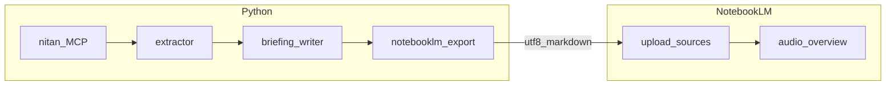
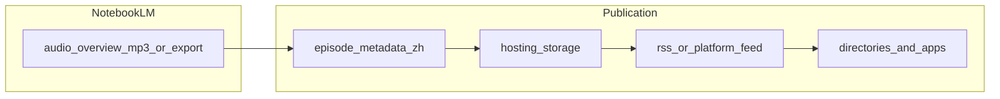

# USCardForum Podcast Automator — NotebookLM-first plan

This ExecPlan is a living document. Update Progress, Surprises & Discoveries, Decision Log, and Outcomes as work proceeds.

## Handoff / current state (agents)

- **`scripts/run_live_demo.sh`** runs MCP → **`demo/output/DEMO_notebooklm_weekly.md`** and passes **`--publish-notebooklm`** (default MP3: **`releases/weekly_meika_podcast.mp3`**).
- **Blocker for exit 0 on full demo:** operator must run **`notebooklm login`** once so **`~/.notebooklm/storage_state.json`** exists; set **`NOTEBOOKLM_NOTEBOOK_ID`** in **`.env`**. Normal **Chrome** Google login is **not** sufficient for **`notebooklm-py`**.
- **Quality / verification:** see [`EVALUATION.md`](EVALUATION.md).

## Purpose / Big Picture

Deliver a repeatable **weekly** workflow where **Google NotebookLM** is the **key solution** for the **spoken podcast**: Python produces **NotebookLM-ready Markdown** from 美卡论坛 (via nitan-MCP); the maintainer (or optional UI automation) **loads those sources into NotebookLM** and uses **Audio Overview** to generate the episode. The plan **also covers the publication flow**: how the finished **audio file** and **metadata** reach **listeners** (hosting, **RSS** if applicable, and **directory**/platform distribution). Publication may be **manual**, **semi-automated** (hosting API + scripted RSS), or **fully outsourced** to a podcast host UI—details stay **configurable** until a hosting choice is made. The **design must support running the Python pipeline as a scheduled weekly job** (e.g. **cron** on a host or **GitHub Actions**): non-interactive, predictable artifacts, logging, and clear **exit codes** for success vs failure. NotebookLM upload/audio may still be **manual** each week unless experimental UI automation is added. **Language requirement:** the delivered podcast must be **in Chinese** — **简体中文** spoken output (natural 口语), not English narration over Chinese sources. Sources and optional Gemini briefing stay **中文** end-to-end; NotebookLM **instructions** must explicitly ask for a **中文** Audio Overview (and desired tone, e.g. 双人/美卡梗) so the model does not default to English.

## Design principles

1. **NotebookLM owns audio** — Quality, voice, and overview style come from NotebookLM unless you explicitly add unofficial UI automation.
2. **Python owns sources** — Accurate, UTF-8, structured **key information** (optional Gemini briefing) so NotebookLM has trustworthy material.
3. **Supported handoff** — Export file on disk → **manual upload** to a notebook. Anything else is experimental.
4. **Chinese-only podcast** — **Sources** and **spoken Audio Overview** are **中文** (Mandarin). Validate by listening and by NotebookLM prompt/instructions; do not assume English output from mixed or English UI defaults.
5. **Weekly job–ready Python** — Orchestrator runs **headlessly** (no stdin prompts in default mode), loads config from **environment / `.env`**, writes **structured logs** to stdout/stderr (or configurable path), exits **non-zero** on failure, and produces **deterministic, discoverable outputs** each run (e.g. `exports/weekly_meika_notebooklm.md` and/or **ISO-week–dated** filenames). Document **cron** and **GitHub Actions** patterns; CI must inject **secrets** (MCP transport, `GEMINI_API_KEY` if used) without committing them.
6. **Publication is a first-class phase** — Treat **post–NotebookLM** steps as part of the overall weekly ritual: **artifact handoff** (MP3 or equivalent), **episode metadata** (中文 title, show notes, season/episode numbering), **hosting + RSS** (or platform-native publishing), and **listener-facing consistency** (cover art, feed URL, directory links). Prefer **documented checklists** until a host/API is chosen; add automation only where it reduces error (e.g. templated show notes from the same Markdown export).

## Architecture



### Publication (downstream — conceptual)



## Publication flow (stages)

1. **Acquire audio** — Download or export the weekly **Audio Overview** (or equivalent) from NotebookLM into a **known path** (e.g. `releases/2026-W13/meika_weekly.mp3`). Naming convention should align with **weekly jobs** (dated or ISO week).
2. **Episode metadata** — **简体中文** episode title, short description / show notes (can reuse bullets from exported Markdown or briefing), optional chapter markers later. Keep a **template** (file or doc) so every week is consistent.
3. **Hosting** — Upload audio to a **podcast host** (e.g. Spotify for Podcasters, Transistor, Pinecast, self-hosted object storage + static site) or **non-RSS** channels only (e.g. **YouTube** as video with still image) if that is the chosen distribution model.
4. **RSS / feed** — If using open podcast distribution, ensure **RSS** item is updated (many hosts do this automatically when you create an episode). Validate feed with a podcast validator if self-hosting.
5. **Distribution** — Apple Podcasts, Spotify, YouTube Music, etc. typically **ingest from RSS** or host dashboards; document which properties you submitted and where the **canonical listen link** lives.
6. **Optional promotion** — Post to 美卡论坛 or social (out of scope for core code unless you add a notifier later).

**Automation boundary (v1):** Expect **manual** or **host-dashboard** steps for steps 1–5 until a specific host + API is selected; record the choice in **Decision Log** when fixed.

## Progress

- [x] (2025-03-25) Project documentation initialized and module stubs aligned with PRD.
- [x] (2025-03-25) Architecture pivot: NotebookLM replaces TTS/pydub; `briefing_writer.py`, `notebooklm_export.py` added; legacy TTS modules removed.
- [x] (2026-03-25) Docs and plan revised: **NotebookLM explicitly the key solution**; architecture diagram; README checklist; `export_for_notebooklm` implemented.
- [x] (2026-03-25) Plan iteration: **Chinese-language podcast** requirement locked (简体中文 sources + Audio Overview via NotebookLM **中文** instructions; validation criteria).
- [x] (2026-03-25) Plan iteration: **Weekly job support** for the Python pipeline (non-interactive orchestrator, exit codes, logging, artifact conventions, cron/GHA documentation — NotebookLM step may remain manual).
- [x] (2026-03-25) Plan iteration: **Publication flow** documented (post–NotebookLM: audio handoff, 中文 metadata, hosting/RSS, distribution; automation TBD per host).
- [x] (2026-03-25) **Execute:** `extractor.py` — MCP stdio client, configurable tool call, fixture path, `threads_to_source_markdown`, `--list-mcp-tools`.
- [x] (2026-03-25) **Execute:** `briefing_writer.py` — Gemini `write_briefing_markdown` (see FINDINGS re: `google-generativeai` deprecation notice).
- [x] (2026-03-25) **Execute:** `notebooklm_export.py` + `run_pipeline.py` — dated filenames via `--dated`; orchestrator with dotenv, logging, exit codes.
- [x] (2026-03-25) **Execute:** `README.md` cron + **publication checklist**; `.github/workflows/weekly-export.yml` + `fixtures/sample_extraction.json`; `.env.example` + `AGENTS.md` env table.
- [x] (2026-03-26) **Demo ready:** `scripts/run_live_demo.sh` + `demo/README.md`; `requirements.txt` includes **cloudscraper/curl-cffi/brotli**; `.env.example` documents **`--python_path`** for Nitan MCP; live run verified (`discourse_list_top_topics` weekly → `demo/output/DEMO_notebooklm_weekly.md`).
- [x] (2026-03-26) **Demo script:** `run_live_demo.sh` chains **`--publish-notebooklm`**; operator completes **`notebooklm login`** + **`.env`** for end-to-end MP3 (see `EVALUATION.md` / `README.md`).
- [x] (2026-03-27) **Publication v1:** `publisher.py` generates episode metadata (中文 title, topic bullets) + 美卡论坛 Discourse post from exported Markdown; `run_pipeline.py --generate-post` (+ `--audio-url`); managed podcast host chosen as distribution model; forum post is primary channel.
- [x] (2026-03-27) **E2E pipeline verified:** Full live run MCP → Gemini → NotebookLM → MP3 succeeded (exit 0, ~20MB MP3, ~6 min). Podcast quality approved after 4 tuning iterations.
- [x] (2026-03-27) **GitHub repo:** Created [lifan-builds/nitan-podcast](https://github.com/lifan-builds/nitan-podcast); initial release v2026-W13 with MP3 on GitHub Releases.
- [x] (2026-03-27) **Podcast tuning:** 4 iterations → `NOTEBOOKLM_AUDIO_LENGTH=short`, 7 threads, fast-paced instructions with keyword hooks, no forum intro → ~6 min approved.
- [x] (2026-03-27) **Forum post generated:** Announcement thread (`exports/nitan_podcast_announcement.md`) + episode reply (`exports/weekly_meika_2026-W13_forum_reply.md`) with topic table and GitHub Release download link.
- [x] (2026-03-27) **Test suite:** pytest tests in `tests/test_pipeline.py` — all pass, no network calls.
- [x] (2026-03-28) **RSS feed & Apple Podcasts:** `rss_feed.py` generates RSS 2.0 + iTunes namespace feed at `docs/feed.xml`; `--generate-rss` flag in pipeline; cover art at `assets/cover.png`; GitHub Pages enabled on `main/docs`; feed live at `https://lifan-builds.github.io/nitan-podcast/feed.xml`; Apple Podcasts listing published.
- [x] (2026-03-26) **Execute:** **[notebooklm-py](https://github.com/teng-lin/notebooklm-py)** integration — [`notebooklm_audio.py`](notebooklm_audio.py), `run_pipeline.py --publish-notebooklm` / `--notebooklm-audio-out`, `releases/` + `.gitignore`, docs + `.env.example`; GHA remains export-only.
- [x] (2026-03-28) **Self-hosted runner:** `nitan-mac` runner online; weekly workflow verified (last run succeeded). Workflow: MCP → Gemini → NotebookLM → GitHub Release → RSS → push.
- [x] (2026-03-28) **Code cleanup:** Removed dead `soundcloud_upload.py` + `--publish-soundcloud`; pinned dependency versions; added `pyproject.toml` (eliminates `sys.path` hacks in tests); extracted duplicated logic in `extractor.py`; fixed test bugs.

## Surprises & Discoveries

- Observation: `google.generativeai` package emits a **FutureWarning** recommending `google.genai`.
  Evidence: local run logs when briefing path is used; logged in `FINDINGS.md`.

- Observation: Operators may assume **signed-in Chrome** satisfies NotebookLM automation; **`notebooklm-py`** only uses Playwright **`notebooklm login`** → **`storage_state.json`**.
  Evidence: `FileNotFoundError` for `~/.notebooklm/storage_state.json` when running `--publish-notebooklm` without CLI login; logged in `FINDINGS.md` Error Log.

- Observation: **Podcast length is primarily controlled by `NOTEBOOKLM_AUDIO_LENGTH`** and thread count, not by text instructions alone. Adding "6-8分钟" to instructions had no effect on a `default` length setting (~20 min output).
  Evidence: 4 tuning iterations; only `short` + 7 threads + concise instructions yielded ~6 min.

## Decision Log

- **Decision:** **NotebookLM** is the **designated key solution** for podcast **audio** (Audio Overview from uploaded sources).
  **Rationale:** Centralizes spoken output; Python focuses on **forum extraction and source quality**.
  **Date:** 2026-03-25

- **Decision:** Use **NotebookLM** instead of ElevenLabs / Azure TTS + pydub.
  **Rationale:** Native overview quality from sources; repo avoids custom TTS pipelines.
  **Date:** 2025-03-25

- **Decision:** Extraction delivers **key information**, not a TTS-oriented dialogue script.
  **Rationale:** NotebookLM generates narration from sources; optional Gemini shapes **Markdown sources** only.
  **Date:** 2025-03-25

- **Decision (default):** **Supported** path is **export → manual NotebookLM upload**. Unofficial UI automation is **non-core**, isolated, documented in `FINDINGS.md`.
  **Rationale:** DOM automation is brittle; session/2FA/ToS risk.
  **Date:** 2025-03-25

- **Decision:** Podcast **audio** must be **简体中文** (Chinese), matching the forum domain and product brief.
  **Rationale:** Avoid English Audio Overview when sources are Chinese; enforce via **NotebookLM instructions** + **Chinese-only** exported sources and briefing.
  **Date:** 2026-03-25

- **Decision:** The implementation **must support scheduled weekly runs** of extract → (optional) brief → export via **automation-friendly** CLI (no interactive default, env-based secrets, logging, non-zero exit on error).
  **Rationale:** Operator runs the same command from **cron** or **GitHub Actions** each week; NotebookLM handoff stays predictable even when upload remains manual.
  **Date:** 2026-03-25

- **Decision:** **Managed podcast host** for distribution; **美卡论坛** as primary publication channel (forum post with episode link + show notes). Specific host TBD (Spotify for Podcasters / 小宇宙 candidates).
  **Rationale:** Forum audience is the primary listener base; managed host provides RSS + directories for broader reach with minimal ops.
  **Date:** 2026-03-27

- **Decision:** **GitHub Releases** as audio hosting; download link in forum post.
  **Rationale:** GitHub Releases is free, reliable, and integrated with the CI workflow.
  **Date:** 2026-03-27

- **Decision:** **Podcast tuning formula:** `NOTEBOOKLM_AUDIO_LENGTH=short` + 7 threads + fast-paced `_DEFAULT_INSTRUCTIONS` (no forum intro, keyword hooks, "点到为止").
  **Rationale:** 4 iterations tested; this combination yields ~6 min episodes matching user preference.
  **Date:** 2026-03-27

- **Decision:** **Publication pattern** follows Nitan MCP thread: single announcement thread + weekly episode replies on 美卡论坛.
  **Rationale:** Proven pattern on the forum; keeps all episodes discoverable in one thread.
  **Date:** 2026-03-27

- **Decision:** **v1 programmatic NotebookLM** uses **`notebooklm-py`** + `NotebookLMClient.from_storage()` after **`notebooklm login`**; gated by **`--publish-notebooklm`**; **`NOTEBOOKLM_NOTEBOOK_ID`** required; **append** new file source each run.
  **Rationale:** Single maintained SDK vs DIY Playwright; unofficial API risk accepted and documented in `FINDINGS.md`.
  **Date:** 2026-03-26

## Outcomes & Retrospective

- **2026-03-27 — First episode published (v2026-W13).** Full E2E pipeline verified: MCP extraction (7 threads) → Gemini briefing → NotebookLM Audio Overview (~6 min, short length) → MP3 downloaded. GitHub Release created at [lifan-builds/nitan-podcast/releases/tag/v2026-W13](https://github.com/lifan-builds/nitan-podcast/releases/tag/v2026-W13). Forum reply generated with topic table + download link. Audio quality approved after 4 tuning iterations.

## Context and Orientation

Repo: **nitan-pod**. **Nitan MCP** supplies forum data — official thread: [uscardforum.com/t/topic/450599](https://www.uscardforum.com/t/topic/450599); package **`@nitansde/mcp`**, repo **nitansde/nitan-mcp**; tool/schema details in [`FINDINGS.md`](FINDINGS.md) and via `run_pipeline.py --list-mcp-tools`. **No official NotebookLM API** for upload/audio export at plan time.

## Plan of Work

1. **MCP** — `extractor.py`: weekly threads + key takeaways per thread.
2. **Sources** — `briefing_writer.py` (optional): one Markdown doc tuned for NotebookLM.
3. **Export** — `notebooklm_export.py`: deterministic paths under `exports/`, UTF-8.
4. **NotebookLM** — Human steps in `README.md`: upload sources, set **中文**-first **instructions** for Audio Overview (and optional Playwright later).
5. **Ops** — Single entrypoint (e.g. `python -m ...` or `run_pipeline.py`) suitable for **cron** / **GitHub Actions**; document required env vars, example schedule, and artifact locations. Optional: publish export as a **workflow artifact** in GHA for download.
6. **Weekly jobs checklist** — Ensure MCP server availability in the job environment (stdio subprocess vs remote), rate limits for Gemini, and **idempotent** or **dated** filenames so reruns do not corrupt history if desired.
7. **Publication** — Finalize hosting; document **operator runbook** (NotebookLM export → upload episode → verify RSS/listen link); add optional automation aligned with host APIs.

## Concrete Steps

```bash
cd /path/to/nitan-pod
python3 -m venv .venv
source .venv/bin/activate
pip install -r requirements.txt
cp .env.example .env
# Configure MCP; optional GEMINI_API_KEY
# python run_pipeline.py   # when orchestrator exists
# Upload exports/*.md to NotebookLM → Audio Overview

# Example: weekly cron (Sunday 06:00 local) — adjust paths and venv
# 0 6 * * 0 cd /path/to/nitan-pod && .venv/bin/python run_pipeline.py >> logs/weekly.log 2>&1
```

## Validation and Acceptance

- Extractor returns structured **key info** when MCP is available.
- Exported Markdown is UTF-8 and loads as a NotebookLM source without garbled Chinese.
- Optional briefing does not corrupt encoding.
- **NotebookLM** produces audio from those sources (manual or experimental automation).
- **Language:** Audio Overview is **predominantly 简体中文** (acceptable brief English for card/product names if natural); instructions in README/plan explicitly require **中文播客**.
- **Weekly job:** Same command succeeds when run **unattended** with secrets present; on intentional failure (MCP down, API error) process exits **non-zero** and logs a clear error; operators can alert on exit code or log pattern.
- **Publication:** After a release, **RSS/listen URL** resolves and episode metadata is **中文**-appropriate; run through the documented checklist once per week until automated.

## Idempotence and Recovery

- Weekly export: choose **stable filename** (overwrite each week) **or** **dated** names (e.g. `weekly_meika_2026-W13.md`); document in orchestrator and README. Reruns the same week should be safe (overwrite or same dated file).
- Job recovery: after fixing infra, re-run the pipeline; no manual cleanup required beyond optional old `exports/` retention policy.

## Artifacts and Notes

- Briefing prompt: [`briefing_writer.py`](briefing_writer.py). Tune NotebookLM **instructions** for **中文** Audio Overview, 双人/口语化 style, and 美卡梗 as needed.
- **Publication:** Keep a **metadata template** (title pattern e.g. `美卡周刊 · 2026年第13周`) and a single **canonical doc** listing feed URL, cover art asset, and directory submission links.

## Interfaces and Dependencies

| Module | Output |
| ------ | ------ |
| `extractor.py` | Structured key info per thread |
| `briefing_writer.py` | Markdown string (optional) |
| `notebooklm_export.py` | Path to `.md` on disk for NotebookLM |

External: nitan-MCP; Gemini API (optional); **Google NotebookLM** (browser); **podcast host** / storage / RSS (TBD); podcast directories (Apple, Spotify, etc.) as configured.
