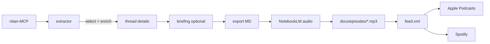

# USCardForum Podcast Automator — NotebookLM-first plan

Living document. Update Progress, Surprises, and Decision Log as work proceeds.

## Handoff / current state

- **Pipeline is fully automated** on self-hosted macOS runner (`nitan-mac`). Weekly schedule: 3 retry windows on Monday.
- **Only manual step:** post `exports/*_forum_reply.md` to the [announcement thread](https://www.uscardforum.com/t/topic/494521).
- **Blocker for audio:** operator must run `notebooklm login` once → `~/.notebooklm/storage_state.json`. Normal Chrome login is **not** sufficient.
- Verification contracts: [`EVALUATION.md`](EVALUATION.md).

## Purpose

Weekly automated podcast: Python extracts hot threads from 美卡论坛 via nitan-MCP → optional Gemini briefing → NotebookLM Audio Overview (简体中文, ~6 min) → MP3 published via GitHub Pages + RSS.

## Architecture

## Progress

### Completed (collapsed)

2025-03-25 → 2026-03-27: Initial build through first episode

- Project init, architecture pivot to NotebookLM-first
- `extractor.py` (MCP), `briefing_writer.py` (Gemini), `notebooklm_export.py`, `run_pipeline.py`
- Demo script, GitHub Actions workflow, fixtures
- `notebooklm-py` integration (`--publish-notebooklm`)
- `publisher.py` (forum posts), `rss_feed.py` (RSS + iTunes)
- First episode published (v2026-W13), podcast tuning (4 iterations → short + 7 threads)
- GitHub repo created, Apple Podcasts listed, GitHub Pages enabled

### Recent (2026-03-28)

- [x] Self-hosted runner `nitan-mac` online; workflow verified
- [x] Code cleanup: removed `soundcloud_upload.py`; pinned deps; `pyproject.toml`; extracted duplicate logic
- [x] Gemini SDK migration: `google-generativeai` → `google-genai`
- [x] Workflow efficiency: `--markdown-input` flag (3 MCP calls → 1); structured thread passthrough; portable `~/.nitan-podcast/.env`
- [x] Publisher tests: 27 tests + `conftest.py` (total: 91 tests)
- [x] RSS fix: `enclosure length="0"` → correct file size + URL
- [x] Audio hosting: GitHub Releases → GitHub Pages (`docs/episodes/`) — fixes Apple Podcasts `application/octet-stream` rejection
- [x] Feed validator: `scripts/validate_feed.py` + workflow Phase 6
- [x] Rich show notes: grouped by category with like/view stats

### Distribution & Content Quality (2026-03-29)

- [x] **Spotify live** — RSS submitted, show approved: `open.spotify.com/show/3jjd0ozToYgW7yje7mfYCg`
- [x] RSS `<itunes:category>` fix — changed to `text` attribute format (Spotify requirement)
- [x] `PODCAST_PLATFORM_LINKS` env var — JSON dict parsed in `run_pipeline.py`, passed as `extra_links` to forum posts
- [x] **Thread detail fetching** — `discourse_read_topic` MCP calls fetch OP content + replies per thread
- [x] **Text response parser** — `_parse_topic_text()` handles nitan-MCP's `- Post #N by @user (date)` format
- [x] **Thread enrichment** — `_enrich_thread()` adds `op_content`, `top_replies` (top 5 by likes), `reply_count`
- [x] **Smarter thread selection** — `select_threads()` scores by likes×3 + views×0.01 + posts×2 with category diversity cap
- [x] **Briefing prompt revamp** — story-driven, community reactions, topic type tags (🔥争议/📦干货/🐑羊毛/📖攻略); temp 0.35→0.5
- [x] **NotebookLM instructions update** — cite replies ("有老哥分享说…"), highlight controversies, allow host personality
- [x] **Richer show notes** — "本期看点" highlights, 💬reply counts, OP teaser lines per thread
- [x] `--skip-details` flag — bypass thread detail fetching for faster runs
- [x] Tests: 91 → 116 (25 new covering enrichment, parsing, selection, platform links)
- [x] Updated forum announcement post with Apple Podcasts + Spotify links
- [ ] Update `MCP_EXTRACT_TOOL_ARGUMENTS` limit from 7→15 to enable thread selection scoring
- [ ] First enriched episode (W14) — verify improved audio quality with new prompts

## Surprises & Discoveries

- **GitHub Releases serves `application/octet-stream`** for all assets. Apple Podcasts requires `audio/mpeg`. Fix: host via GitHub Pages.
- **Podcast length** controlled by `NOTEBOOKLM_AUDIO_LENGTH` + thread count, not text instructions. "6-8分钟" in instructions had zero effect.
- **`notebooklm login` ≠ Chrome sign-in.** Playwright session storage is separate.
- **`google.generativeai` deprecated** → migrated to `google-genai`.
- **`discourse_read_topic` returns text, not JSON.** Format: `- Post #N by @user (date)\n  content`. Required custom parser instead of reusing `tool_result_to_threads`.
- **小宇宙 deprioritized** — no web creator portal; in-app submission only. User decided to skip.

## Decision Log

| Decision | Rationale | Date |
|----------|-----------|------|
| NotebookLM = audio engine | Centralizes spoken output; Python focuses on sources | 2026-03-25 |
| 简体中文 podcast | Forum audience is Chinese; enforce via instructions + sources | 2026-03-25 |
| `notebooklm-py` for automation | Best-maintained unofficial SDK; `--publish-notebooklm` flag | 2026-03-26 |
| GitHub Pages for MP3 hosting | Correct `audio/mpeg` content-type; Releases broke Apple Podcasts | 2026-03-28 |
| Tuning: `short` + 7 threads | 4 iterations tested; ~6 min episodes match user preference | 2026-03-27 |
| Forum: announcement + replies | Proven Nitan MCP pattern; all episodes in one thread | 2026-03-27 |
| Spotify distribution | RSS already compatible; submitted feed directly | 2026-03-29 |
| Skip 小宇宙 | No web creator portal; low priority vs other improvements | 2026-03-29 |
| Thread detail enrichment via MCP | `discourse_read_topic` per thread; OP + top replies improve content depth | 2026-03-29 |
| Story-driven briefing prompt | Old prompt too dry; new tone = "telling a friend what happened" | 2026-03-29 |
| Category diversity in selection | Cap 3 per category from pool of 15; prevents monotopic episodes | 2026-03-29 |

## Outcomes

- **2026-03-27 — First episode (v2026-W13).** Full E2E: MCP → Gemini → NotebookLM → ~6 min MP3. Forum post + GitHub Release published.
- **2026-03-28 — Pipeline fully automated.** Self-hosted runner, RSS feed, Apple Podcasts, feed validator, rich show notes.
- **2026-03-29 — Distribution + content quality.** Spotify live. Thread detail fetching (OP + replies), smarter selection, story-driven prompts, richer show notes. 116 tests.
