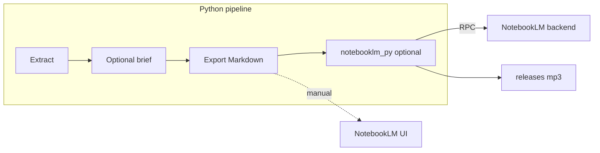

# Nitan Podcast — 美卡论坛 (USCardForum) 每周AI播客

**论坛帖：[【Nitan Podcast】你的每周美卡论坛精华播客](https://www.uscardforum.com/t/topic/494521)**

**Google NotebookLM is the key solution for the podcast:** it turns weekly forum **sources** into **spoken audio** (e.g. **Audio Overview**). This repo is a **Python 3.10+** pipeline that **extracts key information** from [uscardforum.com](https://uscardforum.com) via [**Nitan MCP**](https://www.uscardforum.com/t/topic/450599) ([`@nitansde/mcp`](https://github.com/nitansde/nitan-mcp)), optionally refines it into Chinese **Markdown** with **Gemini**, and **exports** a file you add to NotebookLM as a **source**.



## Run the pipeline (weekly job–ready)

From the repo root (non-interactive; exits `0` / `1`; logs on stderr):

```bash
# Discover MCP tool names (requires MCP_SERVER_* set)
python run_pipeline.py --list-mcp-tools

# Full run: MCP extract → Gemini briefing → exports/weekly_meika_notebooklm.md
python run_pipeline.py

# Same but ISO-week filename (good for archives)
python run_pipeline.py --dated

# Skip Gemini (export structured Markdown from extraction only)
python run_pipeline.py --skip-briefing

# Dry run without a live MCP server
EXTRACTION_FIXTURE_PATH=fixtures/sample_extraction.json python run_pipeline.py --skip-briefing --dated

# After: pip install -r requirements-integrations.txt && notebooklm login
# Set NOTEBOOKLM_NOTEBOOK_ID in .env (see .env.example)
python run_pipeline.py --skip-briefing --dated --publish-notebooklm
```

The last line printed to **stdout** is the absolute path to the written **Markdown** file, or to the downloaded **MP3** if you pass **`--publish-notebooklm`**.

### Quick live demo (Nitan MCP + 本周热帖 + programmatic publish)

After `pip install -r requirements.txt` (includes **cloudscraper** / **curl-cffi** for Nitan’s Cloudflare bypass), from repo root:

```bash
./scripts/run_live_demo.sh
```

This script passes **`--publish-notebooklm`**. For **exit 0** end-to-end (Markdown **and** MP3):

1. `pip install -r requirements-integrations.txt` and `playwright install chromium`
2. **`notebooklm login`** once (stores **`~/.notebooklm/storage_state.json`** — not the same as signing into Google in Chrome alone)
3. **`NOTEBOOKLM_NOTEBOOK_ID`** in **`.env`** (see [`.env.example`](.env.example))

It always writes **`demo/output/DEMO_notebooklm_weekly.md`** before the publish step; on auth/config failure the process exits **non-zero** after that file is written. Default audio: **`releases/weekly_meika_podcast.mp3`**. Details: [`demo/README.md`](demo/README.md).

### Environment

Copy [`.env.example`](.env.example) to `.env`. Official Nitan MCP context: [美卡论坛介绍帖](https://www.uscardforum.com/t/topic/450599), [nitan.ai/mcp](https://nitan.ai/mcp).

Required for a **live** MCP run:

- `MCP_SERVER_COMMAND` / `MCP_SERVER_ARGS` — e.g. `npx` + `["-y","@nitansde/mcp@latest","--python_path","/abs/path/to/.venv/bin/python"]` so Nitan MCP uses this venv’s Python (Cloudflare deps)  
- `NITAN_USERNAME` / `NITAN_PASSWORD` — recommended for full access (forum **2FA off** per upstream docs)  
- `MCP_EXTRACT_TOOL` — from `python run_pipeline.py --list-mcp-tools` (e.g. hot/top list or `discourse_search` with filters)  
- `MCP_EXTRACT_TOOL_ARGUMENTS` — JSON object matching that tool’s schema  

Optional: `TIME_ZONE`, `GEMINI_API_KEY`, `GEMINI_MODEL`, `EXTRACTION_FIXTURE_PATH`, `MCP_SERVER_ENV_JSON`, and **`NOTEBOOKLM_*`** when using `--publish-notebooklm` (see [`.env.example`](.env.example)).

Tool names and parameters are **version-specific**; see [`FINDINGS.md`](FINDINGS.md) for a summary and always verify with `--list-mcp-tools`.

## NotebookLM checklist (supported path)

1. Run `python run_pipeline.py` (or your cron/GitHub Action) and note the path under `exports/`.
2. Open [NotebookLM](https://notebooklm.google.com) and create or open a **notebook**.
3. **Add source** → upload the exported **Markdown** file.
4. Set **instructions** to require **简体中文**口播 (e.g. **双人讨论**、**口语化**、保留美卡梗如 5/24、史高、冥币).
5. Generate **Audio Overview** and use the product UI to listen or export audio.

## Subscribe

| Platform | Link |
| -------- | ---- |
| **RSS** | `https://lifan-builds.github.io/nitan-podcast/feed.xml` |
| **美卡论坛** | [announcement thread](https://www.uscardforum.com/t/topic/494521) |

## Publication (美卡论坛 + GitHub Releases)

**Primary channel:** 美卡论坛 — single announcement thread + weekly episode replies (Nitan MCP pattern).

```bash
# Generate forum post alongside the weekly export
python run_pipeline.py --skip-briefing --dated --publish-notebooklm --generate-post

# With an audio URL (e.g. after uploading to GitHub Releases)
python run_pipeline.py --skip-briefing --dated --generate-post --audio-url "https://..."
```

**Audio hosting:** [GitHub Releases](https://github.com/lifan-builds/nitan-podcast/releases) (download link in forum post).

### Weekly operator checklist

The workflow is fully automated — the only manual step is posting to the forum:

1. Copy `exports/*_forum_reply.md` content as a reply to the [announcement thread](https://www.uscardforum.com/t/topic/494521) (~30 sec)

Everything else (extract → audio → GitHub Release → RSS → push) runs automatically.

## GitHub Actions (Automated Weekly Pipeline)

The [weekly workflow](.github/workflows/weekly-export.yml) runs the full pipeline on a **self-hosted macOS runner** — your Mac.

**Schedule:** 3 retry windows every Monday (6 AM / 12 PM / 6 PM PST). Your Mac only needs to be on for **one** of the three windows. The first successful run publishes the episode; subsequent triggers detect the existing GitHub Release and skip.

**Pipeline steps (all automatic):**

1. MCP extract → Gemini briefing → export Markdown
2. NotebookLM → generate Audio Overview → MP3
3. Create GitHub Release with MP3 attached
4. Generate RSS feed (`docs/feed.xml`) + forum post draft
5. Commit and push RSS feed (GitHub Pages auto-deploys)

**Manual trigger:** Go to Actions → `weekly-podcast` → Run workflow. Inputs: `skip_audio` (boolean), `audio_url` (override URL).

**Failure handling:** If NotebookLM session expires, the job still produces Markdown + RSS (without audio). Re-run `notebooklm login` on your Mac and trigger manually.

### Self-hosted runner

The runner (`nitan-mac`) is installed and online. To verify:

```bash
gh api repos/lifan-builds/nitan-podcast/actions/runners --jq ‘.runners[] | {name, status}’
```

See [`scripts/setup_runner.sh`](scripts/setup_runner.sh) for prerequisite checks if re-installing.

## Why not TTS in code?

**NotebookLM** centralizes spoken quality and **中文** Audio Overview; this repo focuses on **accurate sources**.

## Programmatic Audio Overview (notebooklm-py)

This repo can call **[notebooklm-py](https://github.com/teng-lin/notebooklm-py)** after export (**undocumented Google APIs** — use at your own risk).

1. `pip install -r requirements-integrations.txt`
2. `playwright install chromium`
3. **Once:** `notebooklm login` (browser; stores session for `NotebookLMClient.from_storage()`).
4. Create a dedicated notebook in the UI; copy **`NOTEBOOKLM_NOTEBOOK_ID`** into `.env` (URL or `notebooklm metadata --json`).
5. Run with **`--publish-notebooklm`**. Audio is written under **`releases/`** (default filename matches `--dated` or `weekly_meika_podcast.mp3`). Override with **`--notebooklm-audio-out`**.

**CI:** The [weekly workflow](.github/workflows/weekly-export.yml) runs `--publish-notebooklm` on a **self-hosted macOS runner** with a persistent NotebookLM session. GitHub-hosted runners cannot use this feature.

Tune generation via env: `NOTEBOOKLM_AUDIO_LANGUAGE` (default `zh`), `NOTEBOOKLM_AUDIO_INSTRUCTIONS`, `NOTEBOOKLM_AUDIO_FORMAT` (`deep_dive` / `brief` / `critique` / `debate`), `NOTEBOOKLM_AUDIO_LENGTH` (`short` / `default` / `long`), timeouts — see [`.env.example`](.env.example) and [`notebooklm_audio.py`](notebooklm_audio.py).

Other community projects are listed in [`FINDINGS.md`](FINDINGS.md).

## Optional: DIY Playwright on the NotebookLM website

Raw browser automation is usually **more brittle** than **`notebooklm-py`**. Either approach is unofficial and may conflict with Google’s terms — see [`FINDINGS.md`](FINDINGS.md).

## Getting Started

### Prerequisites

- Python 3.10+
- **nitan-MCP** (stdio) or `EXTRACTION_FIXTURE_PATH` for testing
- Optional: **Gemini API** key
- **Google account** with **NotebookLM**

### Installation

```bash
git clone https://github.com/lifan-builds/nitan-podcast.git
cd nitan-podcast
python3 -m venv .venv
source .venv/bin/activate
pip install -r requirements.txt
cp .env.example .env
```

## Development

- [`AGENTS.md`](AGENTS.md) — architecture (**NotebookLM-first**).
- [`PLANS.md`](PLANS.md) — living plan.
- [`FINDINGS.md`](FINDINGS.md) — research and error log.
- [`EVALUATION.md`](EVALUATION.md) — verification contracts and evaluation log.

## Project Structure

| File | Purpose |
| ---- | ------- |
| `run_pipeline.py` | CLI orchestrator (weekly jobs, exit codes, logging) |
| `extractor.py` | MCP client + optional fixture + Markdown fallback |
| `briefing_writer.py` | Optional Gemini → Markdown for NotebookLM |
| `notebooklm_export.py` | Write UTF-8 export files |
| `notebooklm_audio.py` | Optional **`notebooklm-py`**: upload MD, generate Audio Overview, download MP3 |
| `publisher.py` | Episode metadata + 美卡论坛 Discourse post: announcement thread + weekly episode replies |
| `rss_feed.py` | Podcast RSS 2.0 feed generator with iTunes namespace |
| `tests/test_pipeline.py` | pytest: extractor, export, briefing, CLI args, integration smoke |
| `tests/test_publisher.py` | pytest: thread extraction, episode metadata, forum post generation |
| `tests/test_rss_feed.py` | 19 RSS feed tests |
| `fixtures/sample_extraction.json` | Sample data for dry runs |
| `scripts/run_live_demo.sh` | One-command live MCP → `demo/output/DEMO_notebooklm_weekly.md` → `--publish-notebooklm` → `releases/*.mp3` when auth/env OK |
| `scripts/setup_runner.sh` | Self-hosted runner prerequisite checker |
| `EVALUATION.md` | Verification contracts for pipeline and demo |
| `demo/README.md` | Demo instructions |
| `requirements-integrations.txt` | Optional **`notebooklm-py[browser]`** for programmatic NotebookLM |

## License

MIT
