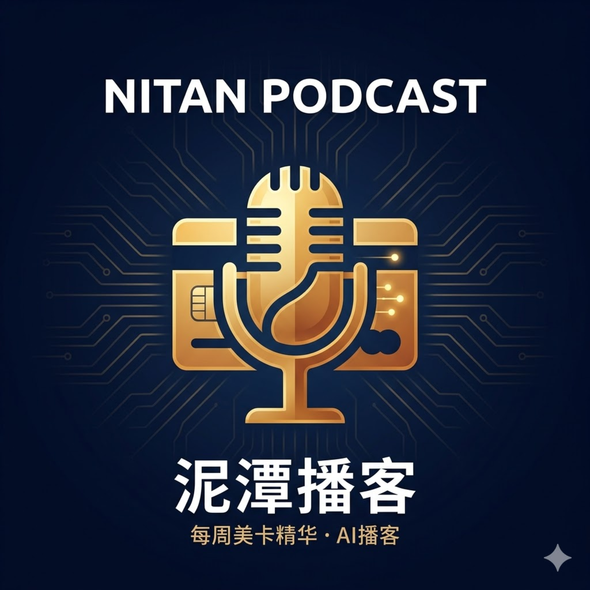
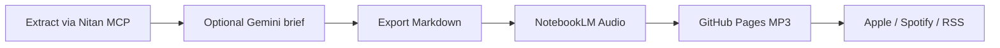

# Nitan Podcast

Weekly Chinese podcast generated from hot discussions on USCardForum.



`Nitan Podcast` is the public show repository: it owns the podcast identity, feed, episode assets, forum post templates, and the Nitan/USCardForum-specific logic behind each episode. Reusable pipeline stages are provided by the pinned `CastForge` dependency; this repo remains the canonical home of the show.

**Forum thread:** [【Nitan Podcast】你的每周美卡论坛精华播客](https://www.uscardforum.com/t/topic/494521)


```mermaid
flowchart LR
  E[Extract via Nitan MCP] --> B[Optional Gemini brief]
  B --> X[Export Markdown]
  X --> NLM[NotebookLM Audio]
  NLM --> MP3[GitHub Pages MP3]
  MP3 --> RSS[Apple / Spotify / RSS]
```

## Subscribe

| Platform | Link |
| -------- | ---- |
| **Apple Podcasts** | [Nitan Podcast](https://podcasts.apple.com/us/podcast/nitan-podcast/id1888784962) |
| **Spotify** | [Nitan Podcast](https://open.spotify.com/show/3jjd0ozToYgW7yje7mfYCg) |
| **RSS** | `https://lifan-builds.github.io/nitan-podcast/feed.xml` |
| **美卡论坛** | [announcement thread](https://www.uscardforum.com/t/topic/494521) |

The [public episode archive](https://lifan-builds.github.io/nitan-podcast/) includes an in-browser player and source notes. See [the 18-episode retrospective](RETROSPECTIVE.md) and [August 2026 baseline](METRICS.md) for what the project learned before the CastForge growth launch.

## Public Compatibility Contract

The automation runs through `CastForge`, but the subscriber-facing surface of this show must stay stable.

- Feed URL stays `https://lifan-builds.github.io/nitan-podcast/feed.xml`
- Site URL stays `https://lifan-builds.github.io/nitan-podcast/`
- Episode URLs stay `https://lifan-builds.github.io/nitan-podcast/episodes/weekly_meika_YYYY-Www.mp3`
- Episode GUIDs keep the `nitan-podcast-YYYY-Www` format
- `docs/feed.xml` and `docs/episodes/` remain the publication targets

That is what keeps Spotify and Apple Podcasts from seeing the migration as a broken or new feed.

## What This Repo Owns

- Nitan MCP extraction and thread-selection logic
- Category voice and Story Brief editorial rules
- Chinese editorial prompts and podcast/forum copy
- Podcast metadata and RSS identity
- `docs/feed.xml` and `docs/episodes/*.mp3`
- Show assets such as cover art
- Validation and tests for this show's public contract

## What `CastForge` Owns

- reusable pipeline stages
- shared integrations for LLM and audio tooling
- framework-level orchestration and contracts

This repository owns the weekly schedule, runner setup, workflow gates, publication, and idempotency policy.

See `podcast.yaml` for the instance contract exposed to `CastForge`, and `docs/castforge-migration.md` for the current integration boundary.

## Quick Start

```bash
git clone https://github.com/lifan-builds/nitan-podcast.git
cd nitan-podcast
python3 -m venv .venv && source .venv/bin/activate
pip install -r requirements.txt
cp .env.example .env
```

`requirements.txt` installs the pinned CastForge release and show-specific dependencies. Configure `MCP_*`, optional `GEMINI_API_KEY`, and `NOTEBOOKLM_*` in `.env`.

## Run The Podcast Pipeline

```bash
python run_pipeline.py --dated
python run_pipeline.py --dated --skip-briefing
python run_pipeline.py --dated --publish-notebooklm
python run_pipeline.py --dated --generate-post --generate-rss --audio-url "https://..."

# Dry run without MCP
EXTRACTION_FIXTURE_PATH=fixtures/sample_extraction.json python run_pipeline.py --skip-briefing --dated
```

Stdout prints the primary output path. See `python run_pipeline.py --help` for the full CLI.

## NotebookLM Setup

For `--publish-notebooklm` using [notebooklm-py](https://github.com/teng-lin/notebooklm-py):

1. `pip install -r requirements-integrations.txt && playwright install chromium`
2. Run `notebooklm login`
3. Set `NOTEBOOKLM_NOTEBOOK_ID` in `.env`

The login stores `~/.notebooklm/storage_state.json`; it is separate from a normal Chrome Google sign-in.

## Automation

This repo owns its own weekly schedule and GitHub Actions workflow. Pipeline execution is powered by `CastForge`, installed from the `v0.1.3` tag through `requirements.txt`. The workflow does not install a second CastForge copy.

The workflow runs on a **self-hosted macOS runner** with three Monday retry windows (6 AM / 12 PM / 6 PM PST). First success publishes the episode; subsequent triggers skip.

Pipeline phases:

1. MCP extract + optional Gemini briefing + export Markdown
2. NotebookLM Audio Overview + download MP3
3. GitHub Release (backup) + copy MP3 to `docs/episodes/`
4. Generate RSS feed + forum post draft
5. Commit + push (GitHub Pages auto-deploys)
6. Validate live feed

**Manual trigger:** Actions tab, `weekly-podcast`, Run workflow.

## Development

```bash
pytest tests/ -v
python scripts/validate_feed.py
```

Useful docs:

- `AGENTS.md` for architecture and conventions
- `docs/castforge-migration.md` for the current CastForge integration boundary
- `podcast.yaml` for the instance contract

## Project Structure

| Path | Purpose |
| ---- | ------- |
| `run_pipeline.py` | Show-specific composition layer around `castforge.pipeline` |
| `extractor.py` | Nitan MCP extraction + fixture support |
| `editorial/category_voice.yaml` | Prescriptive category voice guide for Story Briefs |
| `castforge.briefing` | Optional Gemini briefing supplied by CastForge |
| `castforge.export` | UTF-8 Markdown export supplied by CastForge |
| `castforge.notebooklm_audio` | NotebookLM upload/generate/download supplied by CastForge |
| `publisher.py` | Episode metadata + forum posts |
| `rss_feed.py` | RSS 2.0 + iTunes feed generator |
| `public_contract.py` | Stable public URLs and identifiers |
| `docs/episodes/` | MP3s served by GitHub Pages |
| `scripts/validate_feed.py` | Feed validator |
| `tests/` | Offline pytest coverage |

## License

MIT
